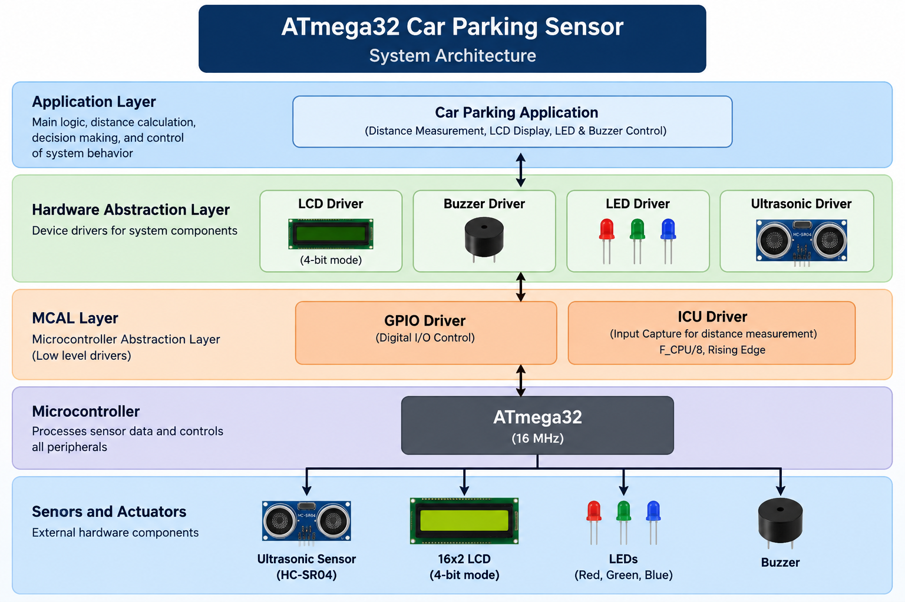

# ATmega32 Car Parking Sensor

An embedded car parking assistance system based on the **ATmega32** microcontroller. The system uses an **HC-SR04 ultrasonic sensor** to measure the distance to nearby obstacles and provides real-time visual and audible warnings through a 16x2 LCD, RGB LEDs, and a buzzer.

---

## Project Overview

This project was developed as part of the **Standard Embedded Diploma - Mini Project 4**.

The objective is to design a simple car parking sensor system that helps detect obstacles and avoid collisions while parking.

The system:

- Measures the distance between the car and an obstacle
- Displays the measured distance on an LCD
- Uses Red, Green, and Blue LEDs to indicate obstacle proximity
- Activates a buzzer when the obstacle is critically close
- Continuously updates the distance measurement

The project uses an **ATmega32 microcontroller running at 16 MHz**. :contentReference[oaicite:0]{index=0}

---

## System Architecture

The project follows the layered architecture specified for the project:

**Application Layer**

↓

**LCD | Buzzer | LED | Ultrasonic**

↓

**GPIO | ICU**

The architecture separates the application logic from device drivers and low-level microcontroller drivers. :contentReference[oaicite:1]{index=1}

---

## Main Features

### Ultrasonic Distance Measurement

The **HC-SR04 ultrasonic sensor** measures the distance between the vehicle and a nearby obstacle.

The ATmega32 measures the time taken for the ultrasonic signal to return after being reflected by an obstacle and uses this measurement to determine the distance.

The measured distance is continuously updated to provide real-time feedback. :contentReference[oaicite:2]{index=2}

---

### LCD Display

A **16x2 LCD** is used in **4-bit mode** to display the measured distance in centimeters.

When the distance becomes less than 5 cm, the LCD displays:

**Stop**

The LCD uses:

- RS → PA1
- Enable → PA2
- D4 → PA3
- D5 → PA4
- D6 → PA5
- D7 → PA6
- R/W → Ground

:contentReference[oaicite:3]{index=3}

---

### LED Indicators

Three LEDs indicate the proximity of an obstacle:

- Red LED
- Green LED
- Blue LED

The LEDs change their state according to the measured distance.

---

### Buzzer Alert

The buzzer provides an audible warning when the obstacle is critically close.

When the distance is **less than or equal to 5 cm**:

- All LEDs flash
- The buzzer sounds
- The LCD displays `Stop`

:contentReference[oaicite:4]{index=4}

---

## Distance Warning Levels

| Distance | Red LED | Green LED | Blue LED | Buzzer | LCD |
|---|---|---|---|---|---|
| ≤ 5 cm | Flashing | Flashing | Flashing | ON | Stop |
| 6 - 10 cm | ON | ON | ON | OFF | Distance |
| 11 - 15 cm | ON | ON | OFF | OFF | Distance |
| 16 - 20 cm | ON | OFF | OFF | OFF | Distance |
| > 20 cm | OFF | OFF | OFF | OFF | Distance |

These distance ranges and output behaviors are defined by the project specification. :contentReference[oaicite:5]{index=5}

---

## Hardware Components

- ATmega32 Microcontroller
- HC-SR04 Ultrasonic Sensor
- 16x2 LCD Display
- Red LED
- Green LED
- Blue LED
- Buzzer

:contentReference[oaicite:6]{index=6}

---

## Pin Configuration

| Component | ATmega32 Pin |
|---|---|
| LCD RS | PA1 |
| LCD Enable | PA2 |
| LCD D4 | PA3 |
| LCD D5 | PA4 |
| LCD D6 | PA5 |
| LCD D7 | PA6 |
| Red LED | PC0 |
| Green LED | PC1 |
| Blue LED | PC2 |
| Buzzer | PC5 |
| Ultrasonic Echo | PD6 |
| Ultrasonic Trigger | PD7 |

:contentReference[oaicite:7]{index=7}

---

## Software Architecture

The application layer communicates with the device drivers, while the device drivers use the low-level GPIO and ICU drivers.

    +------------------------------------------------+
    |              APPLICATION LAYER                 |
    |                                                |
    | Distance Measurement                           |
    | Obstacle Detection                             |
    | LCD Display                                    |
    | LED Control                                    |
    | Buzzer Control                                 |
    +------------------------------------------------+
                         |
                         v
    +------------------------------------------------+
    |              DEVICE DRIVER LAYER              |
    |                                                |
    |      LCD   |   Buzzer   |   LED   | Ultrasonic|
    +------------------------------------------------+
                         |
                         v
    +------------------------------------------------+
    |          MICROCONTROLLER DRIVER LAYER          |
    |                                                |
    |                 GPIO   |   ICU                |
    +------------------------------------------------+
                         |
                         v
    +------------------------------------------------+
    |                    ATmega32                    |
    |                     16 MHz                     |
    +------------------------------------------------+

---

## GPIO Driver

The project uses the GPIO driver implemented during the course.

The GPIO driver provides the digital input/output functionality required by:

- LCD
- LEDs
- Buzzer
- Ultrasonic trigger

The project specification requires using the same GPIO driver implemented in the course. :contentReference[oaicite:8]{index=8}

---

## ICU Driver

The **Input Capture Unit (ICU)** is used to measure the echo pulse generated by the ultrasonic sensor.

The ICU captures the duration of the echo signal so that the ultrasonic driver can calculate the obstacle distance.

### ICU Configuration

- Frequency: **F_CPU / 8**
- First detected edge: **Rising edge**
- Callback function used for edge processing

The ICU initialization and callback are called from the `Ultrasonic_init()` function. :contentReference[oaicite:9]{index=9}

---

## Ultrasonic Driver

The ultrasonic driver provides an abstraction layer between the application and the HC-SR04 sensor.

### Ultrasonic_init()

Initializes the ICU driver, sets the ICU callback, and configures the ultrasonic trigger pin as an output through the GPIO driver.

### Ultrasonic_Trigger()

Generates the trigger pulse required by the HC-SR04 ultrasonic sensor.

### Ultrasonic_readDistance()

Triggers a measurement, starts the measurement process through the ICU driver, and returns the measured distance in centimeters.

### Ultrasonic_edgeProcessing()

Acts as the ICU callback and calculates the high-time or pulse duration generated by the ultrasonic sensor.

These functions are explicitly required by the project specification. :contentReference[oaicite:10]{index=10}

---

## Ultrasonic Measurement Flow

    Application
         |
         v
    Ultrasonic_readDistance()
         |
         v
    Ultrasonic_Trigger()
         |
         v
    HC-SR04 sends ultrasonic pulse
         |
         v
    Obstacle reflects the signal
         |
         v
    Echo signal returns
         |
         v
    ICU captures echo pulse
         |
         v
    Ultrasonic_edgeProcessing()
         |
         v
    Calculate pulse duration
         |
         v
    Calculate distance
         |
         v
    Return distance in cm

---

## Application Flow

    +----------------------+
    |        Start         |
    +----------------------+
               |
               v
    +----------------------+
    |  Initialize Drivers  |
    +----------------------+
               |
               v
    +----------------------+
    | Read Distance        |
    +----------------------+
               |
               v
    +----------------------+
    | Display Distance     |
    +----------------------+
               |
               v
       +-------+-------+
       |       |       |
       v       v       v
     <=5 cm  6-20 cm  >20 cm
       |       |       |
       v       v       v
    Critical  LED     LEDs OFF
     Alert   Control  Buzzer OFF
       |
       +-------+-------+
       |               |
       v               v
    Stop LCD       Buzzer ON

---

## Warning Behavior

### Distance ≤ 5 cm

Critical warning condition.

- Red LED flashes
- Green LED flashes
- Blue LED flashes
- Buzzer ON
- LCD displays `Stop`

### Distance 6 - 10 cm

- Red LED ON
- Green LED ON
- Blue LED ON
- Buzzer OFF
- LCD displays distance

### Distance 11 - 15 cm

- Red LED ON
- Green LED ON
- Blue LED OFF
- Buzzer OFF
- LCD displays distance

### Distance 16 - 20 cm

- Red LED ON
- Green LED OFF
- Blue LED OFF
- Buzzer OFF
- LCD displays distance

### Distance > 20 cm

- Red LED OFF
- Green LED OFF
- Blue LED OFF
- Buzzer OFF
- LCD displays distance

---

## Driver APIs

### Buzzer Driver

    void Buzzer_init(void);
    void Buzzer_on(void);
    void Buzzer_off(void);

The buzzer driver initializes the buzzer, activates it during critical distance conditions, and deactivates it when the obstacle is no longer within the critical range. :contentReference[oaicite:11]{index=11}

### Ultrasonic Driver

    void Ultrasonic_init(void);
    void Ultrasonic_Trigger(void);
    uint16 Ultrasonic_readDistance(void);
    void Ultrasonic_edgeProcessing(void);

:contentReference[oaicite:12]{index=12}

---

## Project Structure

    ATmega32-Car-Parking-Sensor/
    │
    ├── README.md
    ├── ATmega32-Car-Parking-Architecture.png
    │
    └── Source/
        ├── Application files
        ├── GPIO Driver
        ├── ICU Driver
        ├── Ultrasonic Driver
        ├── LCD Driver
        ├── LED Driver
        ├── Buzzer Driver
        └── ATmega32 support files

---

## Engineering Concepts Demonstrated

- Embedded C programming
- ATmega32 microcontroller programming
- Layered embedded software architecture
- Hardware abstraction
- Modular driver development
- GPIO driver implementation
- ICU / Input Capture
- Ultrasonic distance measurement
- HC-SR04 interfacing
- LCD interfacing
- LED control
- Buzzer control
- Real-time distance monitoring
- Callback functions
- Peripheral driver integration

---

## System Requirements

### Microcontroller

**ATmega32**

### System Frequency

**16 MHz**

### Main Drivers

- GPIO
- ICU
- Ultrasonic
- LCD
- LED
- Buzzer

### Main Hardware

- ATmega32
- HC-SR04 Ultrasonic Sensor
- 16x2 LCD
- Red LED
- Green LED
- Blue LED
- Buzzer

---

## Key Takeaway

This project demonstrates the integration of low-level microcontroller drivers, reusable device drivers, and application logic to create a real-time car parking assistance system.

It provides practical experience with:

- GPIO
- ICU / Input Capture
- Ultrasonic sensors
- LCD interfaces
- LED indicators
- Buzzer alerts
- Embedded C
- Layered driver architecture
- Callback-based peripheral handling

The resulting system continuously measures obstacle distance and provides visual and audible proximity feedback to assist the driver while parking.

---

## Author

**Adham Muhammed**

Embedded Software Engineer
